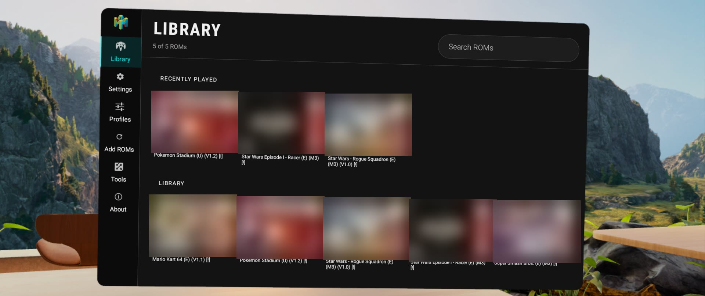
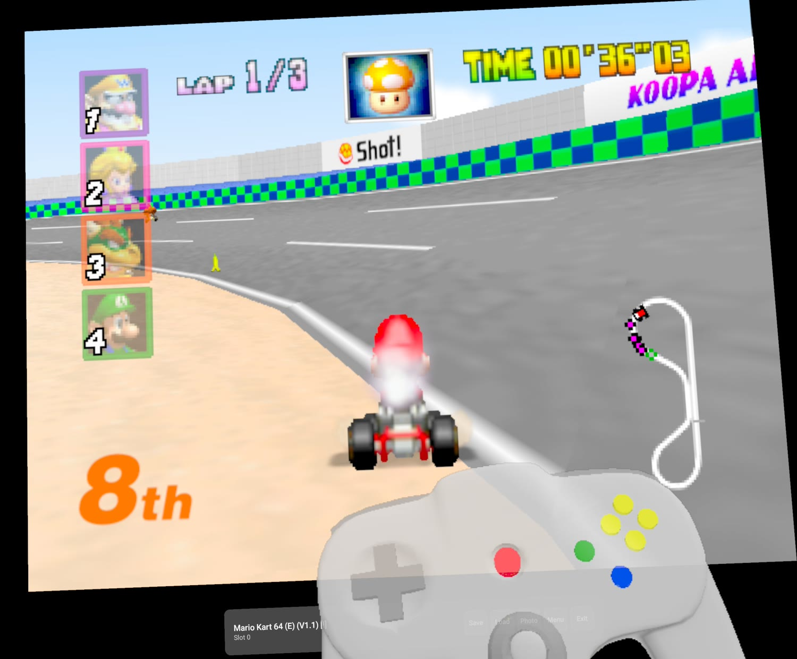
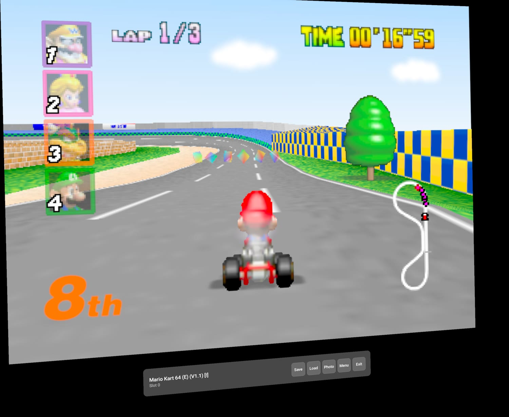
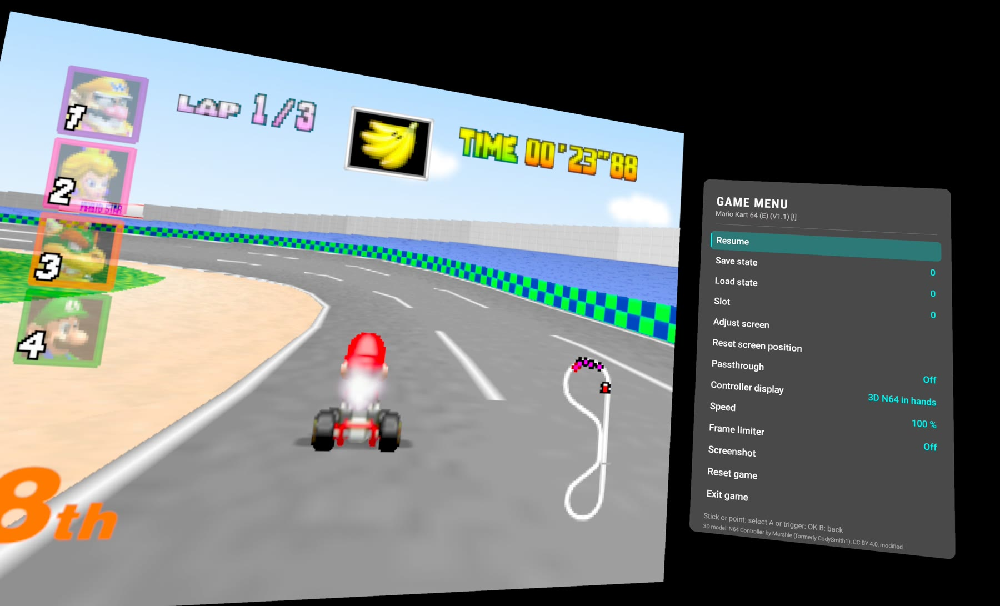
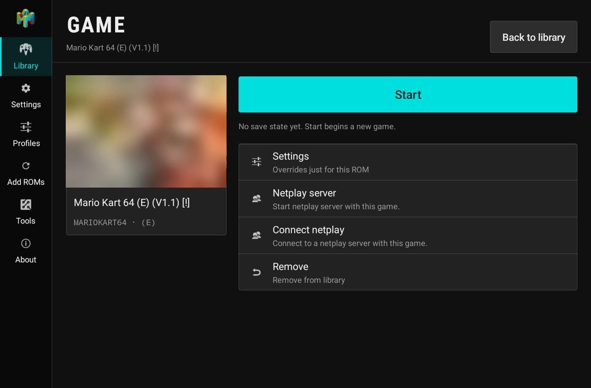
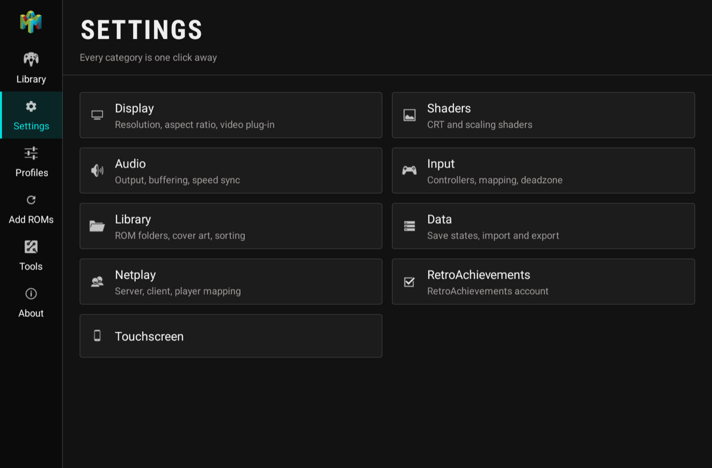
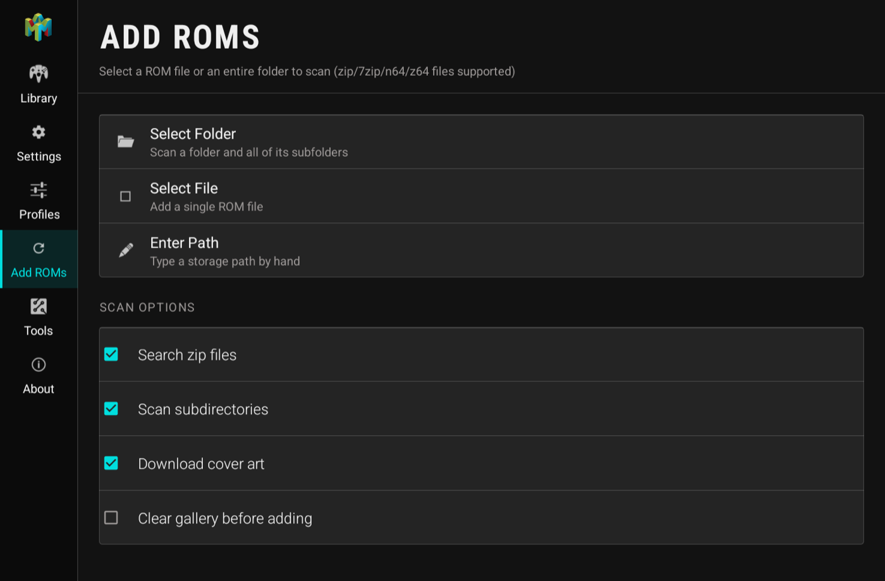
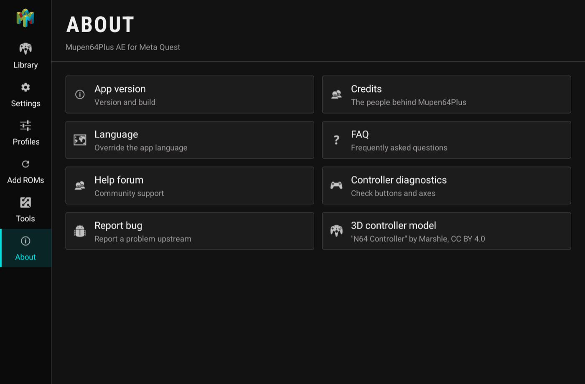

# M64Plus Quest

**N64 on the Meta Quest, in VR, with the Touch controllers.**

M64Plus Quest is a fork of [Mupen64Plus-AE](https://github.com/mupen64plus-ae/mupen64plus-ae)
that turns the emulator into a native OpenXR application. The game is not a flat window floating in
a phone app any more: it hangs in your room on a screen you place yourself, the Touch controllers
are a real N64 controller, and a 3D controller model in your hands lights up as you press buttons.

Everything the original does — the Mupen64Plus core, save states, netplay, RetroAchievements,
texture packs, shaders — still works. This fork adds the headset.



## What this fork adds

**It runs in VR, not on a phone screen.** A real OpenXR session with a quad layer for the game,
so the picture is sharp and stays where you put it while you move your head.

**The Touch controllers are the N64 controller.** No remapping, no configuration, no extra gamepad:

| N64 | Touch |
|---|---|
| Analog stick | Left stick |
| A / B | A / B |
| C buttons | Right stick |
| D-pad | Hold the right grip, then the right stick |
| L | Left trigger |
| R | Right trigger |
| Z | Left grip |
| Start | Tap Menu |
| VR menu | Hold Menu |

**Passthrough.** See your room around the game, with the screen shaped like a Horizon window.

**Place the screen where you want it.** Grab it with a grip and move it, push the stick to resize.
The position is remembered per mode, so passthrough and full VR each keep their own.

**A 3D N64 controller in your hands.** Rendered in the projection layer between the controllers,
its buttons glowing as you press them — the Z trigger shines through the shell. It can also be
shown as a flat overlay under the screen, or turned off.



**A dock under the screen and a menu beside it.** Point at them with a controller, the trigger
clicks. Save, load, screenshot, menu and exit are always one click away, and opening the menu no
longer covers the game.

**Netplay from inside VR.** Hosting and joining a room works in the headset, without the 2D dialogs
that are invisible in an immersive app.

**A library built for a headset.** A persistent rail, big hit targets, and every settings category
one click away instead of buried in a drawer.

## Screenshots

Mario Kart 64 on a screen in the room, with the dock below it:



The in-game menu opens beside the picture instead of on top of it, and a controller can point at it:



The library and every settings screen, captured from the panel (cover art blurred):

| | |
|---|---|
|  |  |
|  |  |

## Install

Download the APK from [Releases](https://github.com/maxnau89/mupen64plus-ae-quest/releases) and
sideload it onto the headset:

```bash
adb install -r M64PlusQuest.apk
```

It installs beside the original app, so an existing M64Plus FZ stays untouched.
You need [developer mode](https://developers.meta.com/horizon/documentation/native/android/mobile-device-setup/)
on the headset. Afterwards the app is under **Apps → Unknown Sources**.

Bring your own ROMs. Copy them to the headset, open **Add ROMs** and point it at the folder.

## Using it

The app opens as a normal 2D panel with your library. Starting a game switches the headset into
immersive VR.

**Hold the Menu button** for the in-game menu: save and load states, the save slot, screen
adjustment, passthrough, controller display, speed, frame limiter, screenshot, reset and exit.
Navigate with a stick and A, or point a controller at it and pull the trigger.

**Adjust screen** hides the menu and lets you place the screen: hold a grip and move your hand to
drag it, push a stick up or down to resize. A, B or a Menu tap finishes.

For netplay, open a game and pick **Netplay server** or **Connect netplay** from the game page.
Online room codes need UPnP enabled on your router.

## Requirements

- A Meta Quest headset. Developed and tested on a Quest 3; other Quest models use the same runtime
  and should work, but have not been tried.
- Developer mode for sideloading
- Your own N64 ROMs

## Building

The VR code lives in the `quest-xr` module: a native OpenXR session in
[`quest_xr.cpp`](quest-xr/src/main/cpp/quest_xr.cpp) with the 3D controller in
[`controller_model.cpp`](quest-xr/src/main/cpp/controller_model.cpp), wrapped by
[`QuestXr.java`](app/src/main/java/paulscode/android/mupen64plusae/game/xr/QuestXr.java).

Prerequisites: JDK 21, the Android SDK with NDK 26.1 and CMake 3.22.1, and `awk`
(`brew install gawk` on macOS).

```bash
./gradlew assembleRelease
```

`tools/quest-install.sh` builds and installs on every attached device, `--launch` also starts it.

Building the original 2D app for phones from this tree still works; the VR code is skipped on
devices that are not a Quest.

## Ideas

[Real stereoscopic 3D](docs/stereo-3d.md) — giving N64 games a per-eye view they never had, the way
Dolphin VR does for GameCube and Wii. Notes on where the hook points are and what would decide
whether it works.

## Credits

- [Mupen64Plus-AE](https://github.com/mupen64plus-ae/mupen64plus-ae) by Paul Lamb, littleguy77 and
  contributors, and the [Mupen64Plus](https://mupen64plus.org/) core team. This fork is a thin
  layer on top of many years of their work.
- The 3D controller is ["N64 Controller" by Marshle](https://sketchfab.com/3d-models/n64-controller-8fb694b8c4bf4bbb8bc66f38503f4ffb)
  (formerly CodySmith1), [CC BY 4.0](https://creativecommons.org/licenses/by/4.0/), converted to a
  compact mesh and split into parts so the buttons can glow.
- OpenXR loader by [Khronos](https://github.com/KhronosGroup/OpenXR-SDK).

## License

GPL-3.0, like the project it comes from. See [gpl-license](gpl-license).
